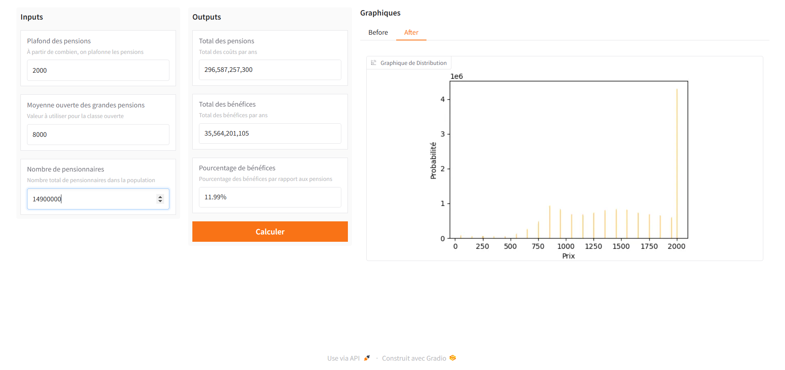

<div align="center">
    <h1 style="font-size: large; font-weight: bold;">Analysis Pension Ceilings</h1>
    <a href="#">
        
    </a>
    <a href="#">
        
    </a>
  <br>
</div>

## Presentation

This project is a Gradio application for analyzing pension ceilings. The idea is to see the impact of capping retirement pensions (for example, at the median salary, which is ~€2,000). What is calculated is the distribution before and after the cap, and the benefits generated by this policy.



## Installation

This project use `rye`, to install the dependencies, you can run the following command:

```bash
rye install
```

## Usage

This project uses `rye`, a Python environment and package manager. If you don’t have `rye` installed, visit [rye documentation](https://github.com/mitsuhiko/rye) for setup instructions.

```bash
rye run src/analysis_pension_ceilings run
```

## Structure

```bash
├── src               # Project source code
├── docs              # Project documentation
│   └── static        # README.md static files
├── tests             # Folder containing software tests
│   ├── units         # Unit tests
│   └── integrations  # Integration tests
├── scripts           # Useful scripts for the project (no CI/CD)
├── ruff.toml         # Ruff configuration file
```

## Containerization

This project uses Docker to containerize the application. The Dockerfile is located at the root of the project. To build the Docker image, you can use the following command:

```bash
docker build -t analysis_pension_ceilings .
```

To run the Docker container, you can use the following command:

```bash
docker run -it -p 7860:7860 analysis_pension_ceilings
```

### Docker-compose

This project have a `docker-compose.yml` file to run the project in production. To run the project, you can use the
following command:

- build: Build the Docker image if not exists
- d: Mode daemon (run in background)

```bash
docker-compose up --build -d
```

### Tips & Other

For debugging purposes, you can run the following command:

```bash
docker run -it -p 7860:7860 xxxxxx /bin/bash
```

For deleting all Docker containers, you can use the following command:

```bash
docker rm -f $(docker ps -a -q)
```

For deleting all Docker images, you can use the following command:

```bash
docker rmi -f $(docker images -q)
``` 

## Contributing

Contributions are welcome! If you'd like to contribute, please fork the repository and create a pull request. Ensure your code follows the project's linting and testing standards.

## License

This project is licensed under the MIT License. See the [LICENSE](LICENSE) file for details.
